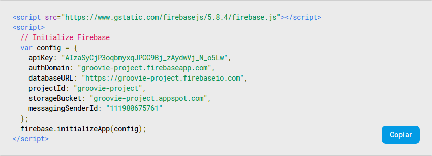
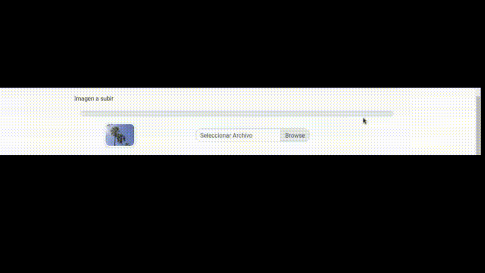

# Upload Image to Storage Firebase using Nuxt.js

Working with Firebase is an awesome experience, such platform provide almost everything you need to create web & mobile apps.

Today we're going to integrate firebase with Nuxt by made a single example.

Considerations

- I'm gonna focus in the logic rather than UI for simplicity
- Demo for Linux OS Ubuntu distro. (I work with ElementaryOS)

## Requirements

- Install Node.js using [nvm](https://github.com/creationix/nvm)
- Install [Git](https://git-scm.com/book/en/v2/Getting-Started-Installing-Git)
- Install [yarn](https://yarnpkg.com/en/docs/install#debian-stable) (optional but very helpful)
- Install [Nuxt.js](https://nuxtjs.org/guide/installation)

## 1. Create Firebase Project

Go to [Firebase](https://console.firebase.google.com) login and create a new project.

So what we need right now is a configuration info from project by going to **Project Overview** and click in **Project Configuration**


Go below and click in **</>** icon, which means it's for web development.


Copy & Paste



Before we go to Nuxt, click in **Storage** from sidebar, go to **Rules** in the tabs, and set like this.

```
service firebase.storage {
  match /b/{bucket}/o {
    match /{allPaths=**} {
      allow read, write
    }
  }
}
```

This will allow us to do all Storage Operations, like download, upload & search (this rules are for demo purpose, or dev enviroments, **Remember** to create the appropiates rules for your app)

## 2. Create the Nuxt Project

I'm gonna create the project using yarn with the name **groovy-project** and install later, **bootstrap** & **firebase**

```
yarn create nuxt-app groovy-project
```

```
yarn add firebase
```

Once it downloaded. I'm gonna create a plugin (which means in the context of Nuxt.js, create a Javascript file), named `fb-init` that contains this:

```
import firebase from "firebase/app";
import "firebase/auth";

var config = {
  apiKey: process.env.FIREBASE_API_KEY,
  authDomain: process.env.FIREBASE_AUTHDOMAIN,
  databaseURL: process.env.FIREBASE_DATABASE_ENDPOINT,
  projectId: process.env.FIREBASE_PROJECTID,
  storageBucket: process.env.FIREBASE_STORAGEBUCKET,
  messagingSenderId: process.env.FIREBASE_MESSAGINGSENDERID
};
export default (!firebase.apps.length
  ? firebase.initializeApp(config)
  : firebase.app());
```

Import such file in the `nuxt.config.js` in plugins section.

```
plugins: ["~plugins/firebase-auth-rest.js"]
```

## 3. Create Vue Component to Upload File

create a vue component **app-uploadfile.vue**, like this.

```
<template>
  <section>
    <div v-if="isUploading" class="p-3">
      <div class="progress">
        <div
          class="progress-bar"
          role="progressbar"
          :style="{'width': progress + '%'}"
          :aria-valuenow="progress"
          aria-valuemin="0"
          aria-valuemax="100"
        >{{progress}}%</div>
      </div>
    </div>
    <div style="display: flex; align-items: center; justify-content: space-around;">
      <div>
        
      </div>
      <div>
        <div class="custom-file">
          <input
            @change="imagePreview($event.target.files[0])"
            type="file"
            class="custom-file-input"
            id="customFileUpload"
            lang="es"
          >
          <label class="custom-file-label" for="customFileLang">Seleccionar Archivo</label>
        </div>
      </div>
      <div>
        <button
          v-if="!isUploading"
          :disabled="!isImageLoaded"
          :class="{'btn-primary': isImageLoaded, 'btn-disabled': !isImageLoaded}"
          @click="uploadImage(imageFile)"
          type="button"
          class="btn"
        >Subir</button>
      </div>
    </div>
    <div class="p-2">
      <div v-if="downloadURL" class="alert alert-dark" role="alert">{{downloadURL}}</div>
    </div>
  </section>
</template>

<script>
import * as firebase from "firebase";

export default {
  data() {
    return {
      placeholderImg: "/placeholder300x300.png",
      imageFile: "",
      isUploading: false,
      isImageLoaded: false,
      progress: 0,
      downloadURL: null
    };
  },
  methods: {
    imagePreview: function(file) {
      self = this;
      this.isImageLoaded = false;

      console.log("imagePreview");
      let reader = new FileReader();

      reader.onloadend = function() {
        self.placeholderImg = reader.result;
        console.log(this.placeholderImg);
      };

      if (file) {
        reader.readAsDataURL(file);
      } else {
        this.placeholderImg = "/placeholder300x300.png";
      }

      this.imageFile = file;
      this.isImageLoaded = true;
    },
    uploadImage: function(file) {
      console.log(file);
      self = this;
      this.isUploading = true;

      let metadata = {
        contentType: "image/jpeg"
      };

      let uploadTask = firebase
        .storage()
        .ref()
        .child("images/" + file.name)
        .put(file, metadata);

      uploadTask.on(
        firebase.storage.TaskEvent.STATE_CHANGED,
        function(snapshot) {
          let progress =
            (snapshot.bytesTransferred / snapshot.totalBytes) * 100;

          self.progress = progress.toFixed(0);
          console.log("self.progress", self.progress);
          console.log("Upload is " + progress + "% done");
        },
        function(error) {
          // A full list of error codes is available at
          // https://firebase.google.com/docs/storage/web/handle-errors
          switch (error.code) {
            case "storage/unauthorized":
              // User doesn't have permission to access the object
              console.log("storage/unauthorized");
              break;

            case "storage/canceled":
              // User canceled the upload
              console.log("storage/canceled");
              break;

            case "storage/unknown":
              // Unknown error occurred, inspect error.serverResponse
              console.log("storage/unknown");
              break;
          }
        },
        function() {
          setTimeout(() => {
            self.isUploading = false;
          }, 350);
          uploadTask.snapshot.ref.getDownloadURL().then(function(downloadURL) {
            console.log("File available at", downloadURL);
            self.downloadURL = downloadURL;
            self.$emit("downloadURL", downloadURL);
          });
        }
      );
    }
  }
};
</script>
```



Import your component in `/pages/index.vue`, and check in your console, when you upload a file.

You will see:

- current uploading
- and when it's complete

Now check in your Firebase project, Storage section. You'll see you image uploaded.

For a deeper comprehension

[Firebase Storage Start](https://firebase.google.com/docs/storage/web/start?hl=es-419)

[Firebase Storage Reference](https://firebase.google.com/docs/storage/web/create-reference?hl=es-419)

[Firebase Upload Files](https://firebase.google.com/docs/storage/web/upload-files?hl=es-419)
