# Improving Web Vitals (LCP) for an upwork client with it's Shopify App

## TL;DR
- Remove unused dependencies
- Replace with more lightweight alternatives libraries
- Rely on Browser Native API to manage date such as [Intl Date Time Format](https://developer.mozilla.org/en-US/docs/Web/JavaScript/Reference/Global_Objects/Intl/DateTimeFormat)
- Asset weight reduction **~29.17%**
- We can go further, but client want me to allocate my time on other valuable task
- Time invested **~27.5 Hrs**

## First, what is Web Vitals?.
Web Vitals is an initiative by Google to provide unified guidance for quality signals that are essential to deliver a great user experience on the web.

## What is a Shopify App?
Shopify apps extend the functionality of shopify, most of them are written by 3rd party developers, not shopify.

Build an app that enhance Shopify Admin Dashboard experience (for merchants) or create unique buying experience for customers (i.e. Storefront) as well as integrate it with third party services. (Paypal, Stripe…)

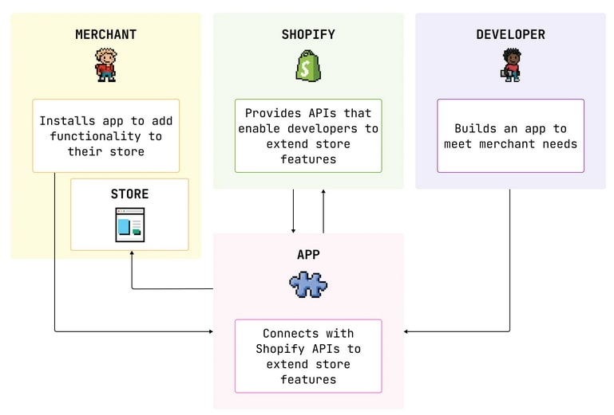

Source - [Shopify Docs](https://shopify.dev/docs/apps/getting-started) 

## How apps fit into shopify?.

When a merchant install and interact with your app it can do the following : 
Add features to enhance the customer buying experience
Extends the merchant experience inside the Shopify admin dashboard or Shopify POS
Integrates third party services

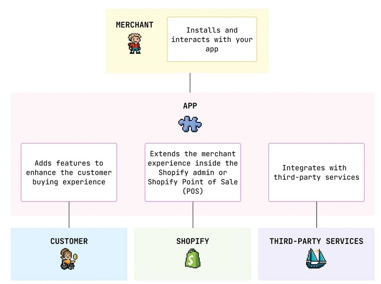

Source - [Shopify Docs](https://shopify.dev/docs/apps/getting-started)

## Build an App and App Surface

After that I created an app and get myself familiar with different Shopify App Features (A.K.A. App Surface), such as:
- Shopify Admin
- Checkout
- Online Store
- Shopify Flow
- Point of Sale
- Server-only apps
- Hosting

## Developer Tools

As well as developer tools such as
- Shopify CLI
- Polaris
- Dev Stores w/ optional test data
- API Libraries
- GraphQL Admin API Explorer

## Best Practices
Then finally look at what really care for this job, Best practice for building Shopify Apps .

To optimize the app development experience, Shopify has established a set of best practices that consider keeping the user’s store fast, accessible, responsive and easy to use, such as : 

- Performance
- Accesibility
- Internationalization
- Mobile First
- Embedding

## Performance

For this task we care more about Performance which from Shopify context it aim to improve the conversion rates, repeat business and search engine ranking, so we got performance best practices for : 

- General
- Shopify Admin Dashboard, Installation and Oauth performance
- Storefront
- Checkout

### Performance and the Shopify App Store
To be published on the Shopify App Store, your app must not reduce storefront lighthouse performance by more than 10pts.

So apps that : 
- Don’t significantly reduce storefront lighthouse performance by more than 10pts
- Meet all the mandatory performance criteria
  - Shopify Admin
  - Checkout

Are eligible for Built for Shopify badge

We can go over the general performance such as : 
1. Include a viewport meta tag 
2. Avoid parser-blocking scripts 
3. Reduce your dependency on external frameworks and libraries 
4. Reduce JavaScript usage 
5. Avoid namespace collisions 
6. Load non-critical resources on interaction 
7. Minimize your bundle size 
8. Include remote stylesheets after inline JavaScript tags  

## Approach

Reduce assets weight from webpack bundler treemap analysis

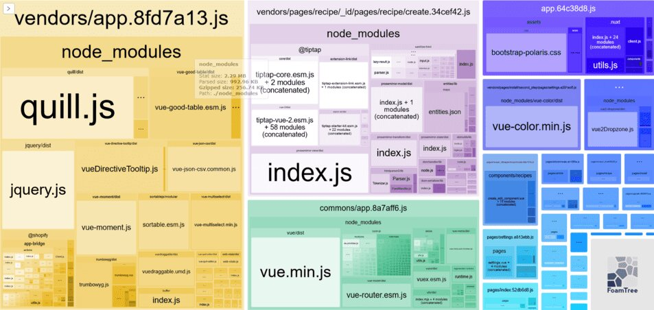

### Client’s Tech Stack
- Vue 2.6
- Nuxt 2
- Node.js
- Postgres
- Redis
- Docker
- Shopify Admin
- Shopify App Theme Extension

## A/B Testing to improve web vitals loading performance (LCP)

Guidelines to follow
- Do one test
- Test one variable
- Make minor changes
- Test Simultaneously
- Split test 50/50
- Decide on significance before testing

Based on Webpack bundle analyzer output we decide to take a look at one the heaviest package like Quill,js. 

## Why Quill.js?
Since Jquery is a general purpose library to interact with the DOM, it might be more tricky to look at it as Quill.js that is a feature library, so we’re assuming that is more easy to spot, replace or remove if needed.

## How to do it?.
Inspect the project using [Code Search Feature](https://code.visualstudio.com/docs/editor/codebasics) to look up Pages & Component using Quill.js 

Before carefully removing unused Quill, throughout the project.

Console Output Before Quill

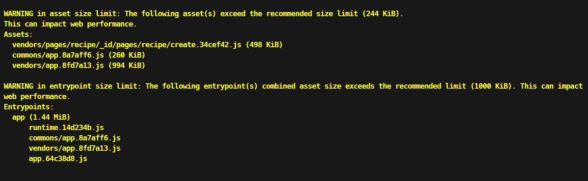

Console Output After Quill

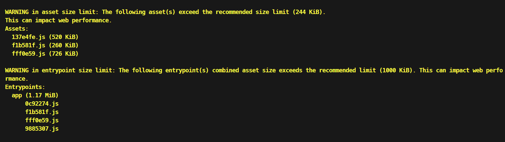

Treemap 

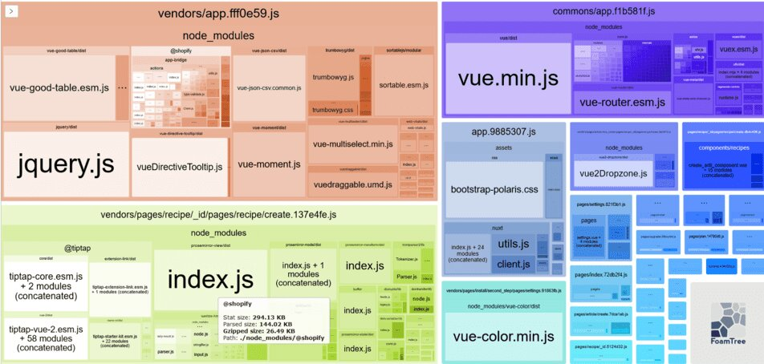
### Results

Assets weight reduction : **18.75%**

## Trumbowyg
Since this library uses Jquery there are 2 possible approaches.

1. Fast
Import library on-demand, per page and component. Right now we’re importing it globally.

2. Recommended
Replace with Tip Tap

We took the 1st for a quick iteration.

From 1.17mb to 1.14 is about 2.56% in assets’ reduction

### Trumbowyg as global dep
Console Output

### Trumbowyg loaded on-demand per component

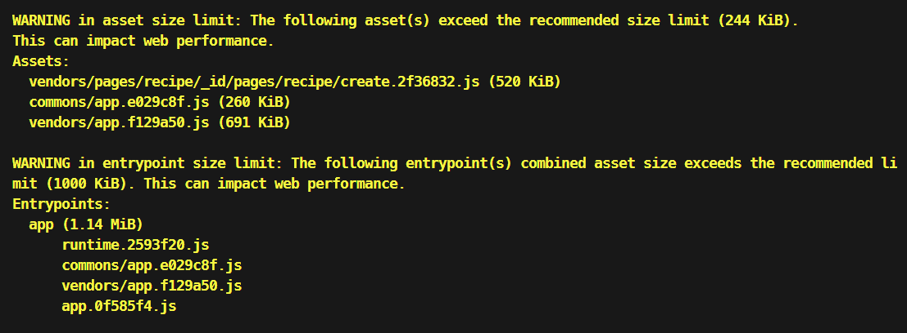

### Results
Current Assets weight reduction : **21.31%**

## Asking ChatGPT 4 for a hand
To further improve performance and accelerate the development process, I ask chatGPT 4 to provide me with a relevant detailed step by step guide for this task.

Step 1: Analyze and Reduce Dependencies
Use tools like npm ls or yarn list to list all the dependencies your project is using.

However I asked myself. How can I automate such a process?.
One of the ChatGPT 4 recommendations was Dependency Auditing Tools, such as dep-check library. So I asked you to provide me with a functional code to do this.

### Results
Despite the output generated, which was good enough and verbose, it is not fit for our needs. Time is against us.

## Replace vueDirective with Floating-vue

Based on the treemap 

We decide to replace vueDirective Tooltip with a more lightweight version.
Making an asset reduction of %6.14, from 1.14Mb to 1.07Mb

### VueDirective
Console Output

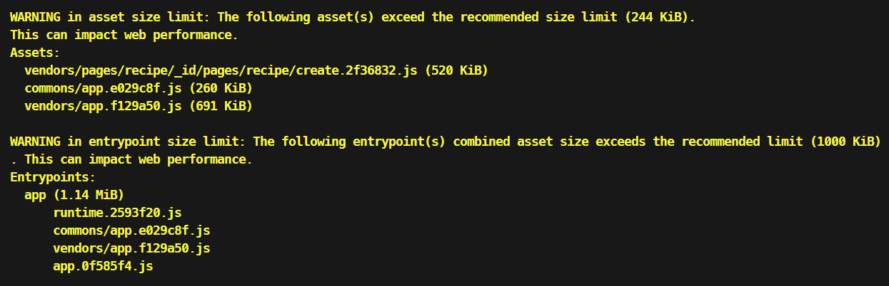

### Floating-vue

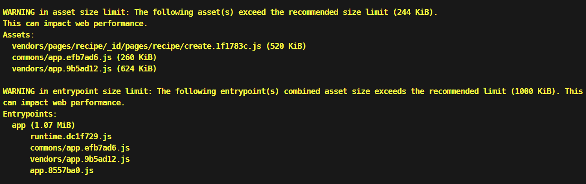

Current TreeMap 

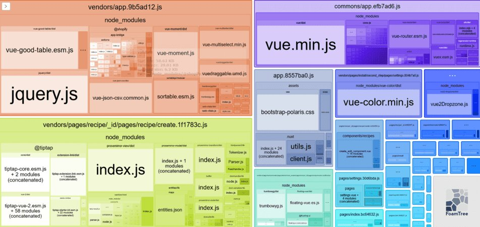

### Results
Assets weight reduction : **6.14%**

Current assets weight reduction : **24.89%**

## Remove, vue-moment in favor of Intl API 

To get same functionality on template

### vue-moment removed
Console Output

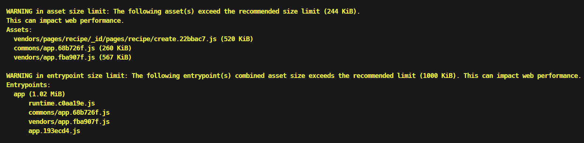

Current TreeMap

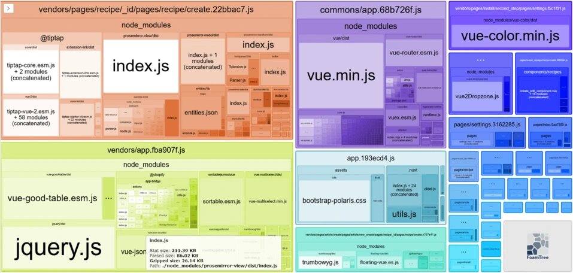

# Total Results

Total assets weight reduction : **~29.17%**

Time Invested
27.5 Hrs from 9/4 to 9/20, 2023